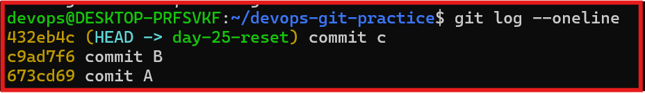
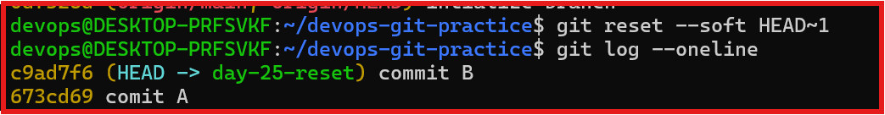
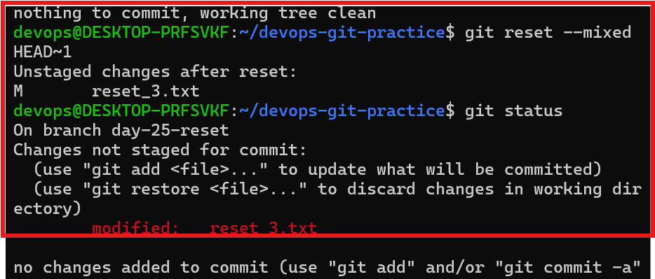
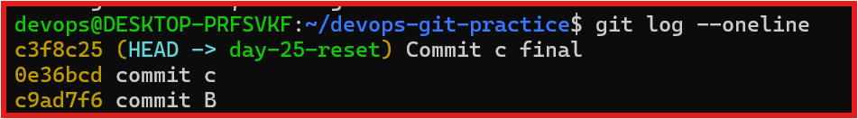
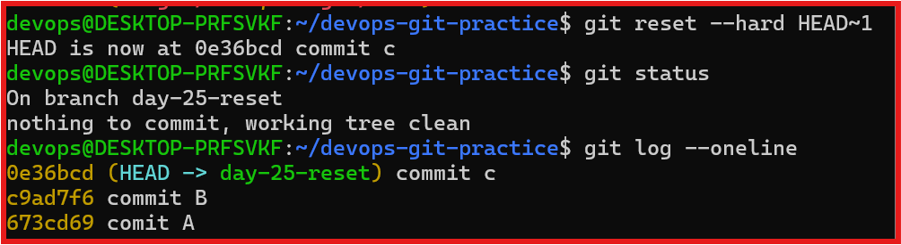
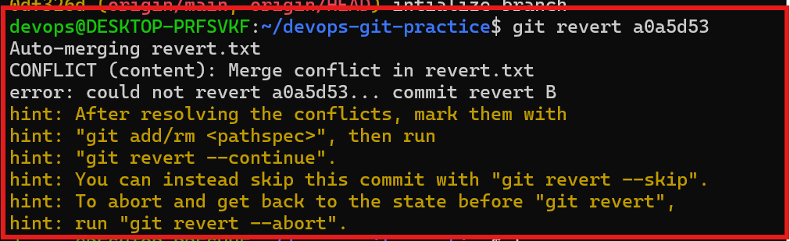
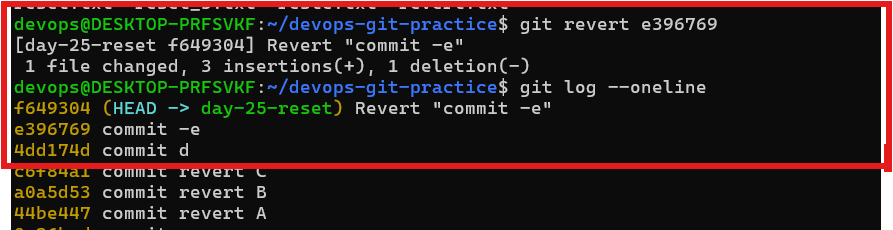

# Day 25- Git Reset Vs Revert & branching strategies

## Task 1: Git Reset - Hands-on

### 1. Make 3 commits in your practice repo (commit A, B, C)

- created three commit in the repository to understand how git Reset affects commit history and files chnages.

### 2. Use `git reset --soft` to go back one commit - what happens to the changes?

- commit c was removed from the commit history

- the changes from commit c were preserved.

- the changes remained in the staging area and were readdy to be commited again.

### 3. Re-commit, then use git reset --mixed to go backe one commit - what happens now?

- commit C was removed from commit history

- The changes were preveserved in the working directory

- The changes becoame unstage and required staging again.

### 4. Re-commit, then use `git reset --hard` to go back one commit - what happens now ?

- commit c was removed front eh commit history

- all changes associated with commit c were discarded

- the repository returned to the previous commit state

- the working directory becomes clean

## kEY TAKEWAYS

#### what is  the diffrence between `--soft`, `--mixed`, and `--hard` ?

| Reset Mode | Commit Removed | Changes Kept | Staged |
|------------|----------------|-------------|---------|
| `--soft` | Yes | Yes | Yes |
| `--mixed` | Yes | Yes | No |
| `--hard` | Yes | No | No |

### which one is distructive and why ?

- `git reset --hard` is destructive because it permanently removes the both the commit and assicated changes.

#### when would you use each one ?

- `reset --soft` - to remove last commit and but keep changes staged

- `reset --mixed` - To remove the last commit and unstage the changes so I can review and selectively stage them again.  

- `reset --hard` - to complete discarte commit and local changes and return go to clean previous state

#### Should you ever use Git Reset on commits that are already pushed ?

- Genrally no 

- Git reset is rewrite the commit history and may cause issue for collaboraters who use sharing branch who have alrady pulled thos commit.

- for shared branches `git revert` is usally the safer choice.

##  Task 2

### 1. Create 3 commits in the practice repository (commit x,y,z) 

- create three squential commits to understand how git revert works on existing commit history

- verified the commit order x -> Y -> z commit.

### 2. Revert Commit Y (the middle commit)

- Attempted to revert commit Y while Commit z existing on top of it.

- Git detected a merge conflict vecsue the changes from commit y were also referenced by later commite.

### 3. check git log - is commit Y still in the reposioty

- Git created a new commit named Revert "Commit Y".
- The original Commit Y was not removed from history.
- Revert preserved the commit history while undoing the changes introduced by Commit Y.

### 4. what is the diffrence between git reset and git revert

| Git Revert | Git Reset |
|------------|-----------|
| Creates a new commit that undoes previous changes | Moves the branch pointer to an earlier commit |
| Preserves commit history | Can rewrite commit history |
| Safe for shared repositories | Better suited for local history cleanup |

#### why is revert considared safer for shared branches

- becuse in revert if one commit have bug then donot delete this create one commit of undo it.

- its not disturbed to the team while pull or push the code.

- revert is not rewrite the history and remove history

- it safe the team to come conflict while push and pull code.

#### When you use revert and reset

- `Git Revert` -> when undoing changes there are alrady pushed or  shared teams.

- `Git reset` when you use own this branch and you want to clean you branch .

## Task 3: Reset Vs Revert

| Feature | `git reset` | `git revert` |
|----------|-------------|--------------|
| **What it does** | Moves the branch pointer to an earlier commit | Creates a new commit that reverses changes from a previous commit |
| **Removes commit from history?** | Yes | No |
| **Rewrites history?** | Yes | No |
| **Safe for shared/pushed branches?** | No | Yes |
| **Best use case** | Cleaning up local commits before pushing | Undoing changes that are already shared |

## Task 4 Branching Strategies

#### How it works 

### 1. GitFlow

- main - production branch (live user uses)
- develop- main devlopement branch
- feature- new feature
- release- prepare to release
- hotflix- emergency production bug fixes

### 2. Simple Diagram

                    feature-login
                  /
develop ---------
               \
                feature-payment
                      |
                      |
                  release-v1.0
                      |
                      ▼
                    main
                      ▲
                      |
                 hotfix-login

#### When/where it's used

- large companies
- Enterprise project
- Banking applications
- Government projects
- Team With Schedule releases

#### pros

✔ Well organized
✔ Stable production
✔ Easy release management
✔ Good for large teams
✔ Easy to maintain different versions

#### Cons

✘ Too many branches
✘ More complex workflow
✘ Slower development
✘ Not ideal for fast daily deployments

### 2. Github Flow

#### How it works

- devloper create feature branch for `main`
- add the new feature in this branch

- open a pull request. get code reviewed, and test.

- merge into main after merging application is delopyed.

#### 2. Simple Diagram

          feature-login
         /
main ───
         \
          Pull Request
               │
               ▼
             main
               │
               ▼
            Deploy

#### 3. When/ where it's used

- startup

- Small to medium teams

- continuous Deployment (CI/CD)

- project that release uptates frequently.

#### 4. pros

- Simple workflow
- Easy to learn
- fast development
- quick deployment
- Less branch management

 5. cons

 - Not ideal for very large teams

 - not suitable for shedule realeases

 - Requires good code reviews and automated testing.

 ### Trunk-based Development

- Trunk-Based Development uses one main branch (trunk) with very short-lived feature branches. Developers make small changes, merge them into the main branch frequently, and deploy continuously. This reduces merge conflicts and keeps the main branch up to date.

#### Simple Diagram

           feature-login
          /
main ─────┼──────► Merge
          \
           feature-payment
                    │
                    ▼
                  main
                    │
                    ▼
                 Deploy

main
 │
 ├── feature-A ──► Merge
 ├── feature-B ──► Merge
 ├── feature-C ──► Merge
 │
 ▼
Deploy           

#### When/where it's used

- Google
- Meta (Facebook)
- Netflix
- Large tech Companies
- Team using Continuous Integration & Continuous Depolyment 

#### 4. pros

- Fast developement
- Fewer merge conflict
- main branch always stays up to date.
- Frequent devlopment

## 5. Cons

- Requires Strong automated testing
- requires a discipline team
- Not suitable without CI/CD

## Task 5. Git Commands Refrence

### Related Documents

- [Git Commands Reference](git-commands.md)