# Day 26 - Github CLI: Manage GitHub from terminal

Learned how to manage repositories, issues, pull requests, workflows, releases, and GitHub API directly from the terminal using GitHub CLI (`gh`).

-----

## Task !: Install & Authentication

- Install Github CLI
- Authentication with github account
- verfy account login

## Authentication support

- browser based authentication
- PAT authnetication (personal acesss token)
- ssh key Authentication

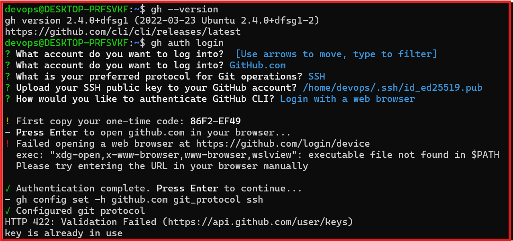

--------

## Task 2: Working with Repository

- created new github repo directly from githcli terminal.

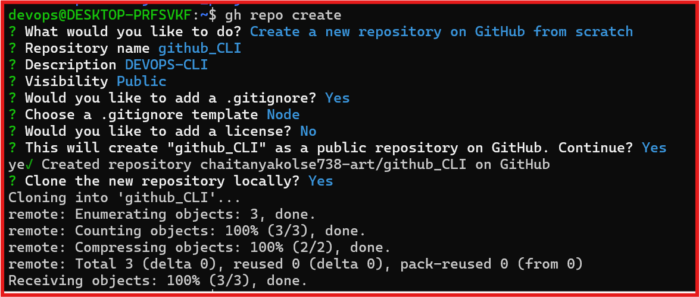

- cloned repo using gh cli.

- list all repository in terminal .

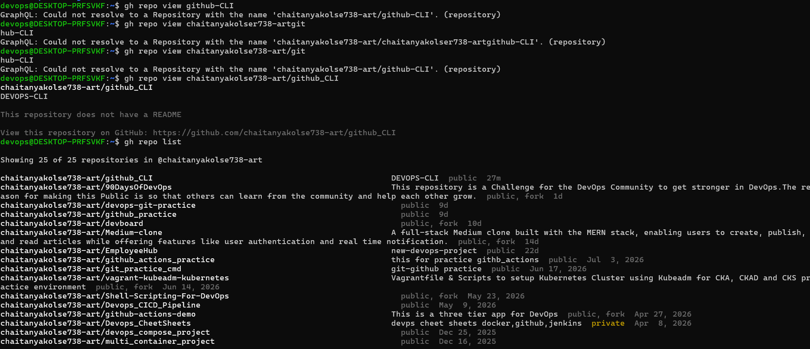

- opend repo browser directly from terminal

- Delete the test repo which was created.

-----------

## Task 3: Issue

- create an issue on one of your repo from the terminal- give it a title,body,and a label

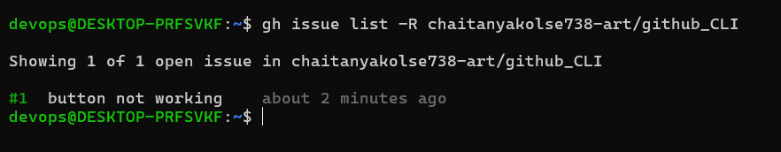

- list all issue created in terminal.

- view specific isuue by the number.

- close the issue 
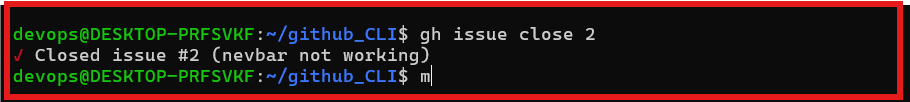

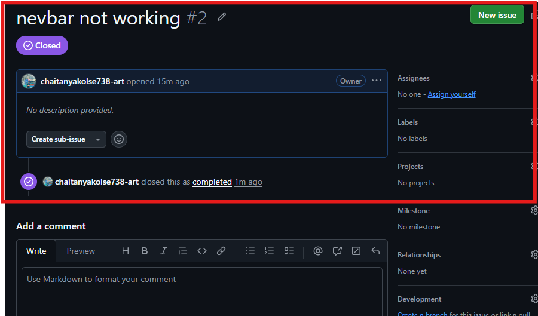

----------

## Pull Request

- create a branch and make change and and create pull requeset in it from terminal

- list all pull request

- merge pull request from the terminal

### what merge pull method does gh pr merge support?
- the gh pr merge is support and sucessfully merge the pull request form terminl by the github CLI.

### PR review using Github CLI

- GitHub CLI allows developers to view pull request details, review changes, inspect commits, and collaborate directly from the terminal.

-----

## Task 5: Github actions & workflow preview

- list workflow runs on any public that uses Github-actions

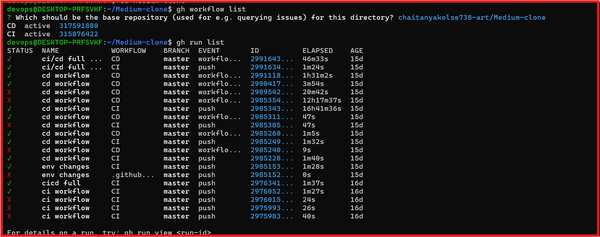

- view the status of specific workflow run

### How could gh run and gh worflow be useful in a CI/CD pipeline ?

- gh workflow is used to manage GitHub Actions workflows such as viewing and triggering workflows. gh run is used to monitor workflow runs, check logs, view build status, and rerun failed jobs. These commands help DevOps engineers manage and troubleshoot CI/CD pipelines directly from the terminal.

-----

## Tasl:6 Useful gh Triks

- gh api make raw api call and provide all user info 

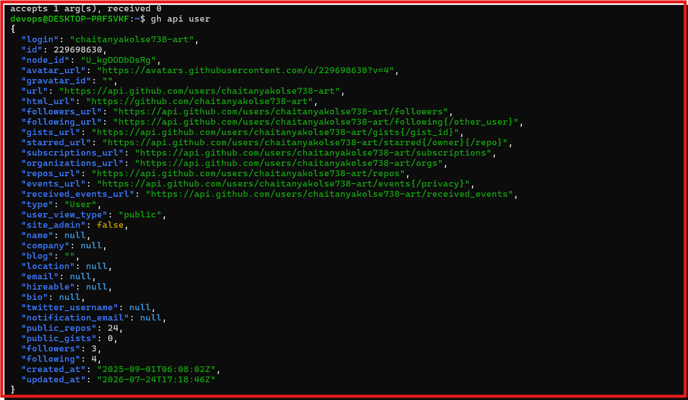

2. gh gist
 - send a samll file from whole project pack this and we can send only this file link.

 3. gh realese
 - this use for reealese stable version of application

 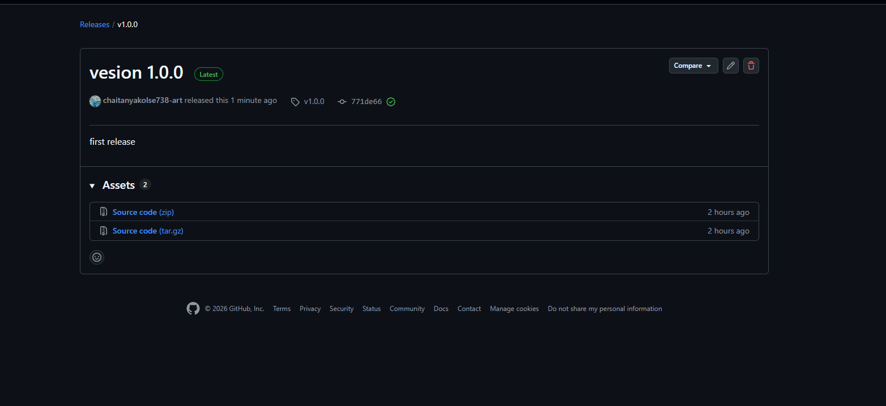

4. gh alias
- use for shortcut cmd if use use daily 100 times pr merge then we can genrte shortcut to this .

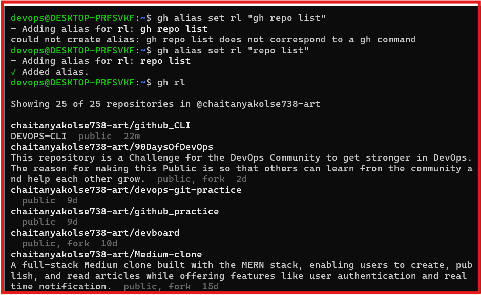

5. gh search repo

- you can serch repo from terminal without open the github ui

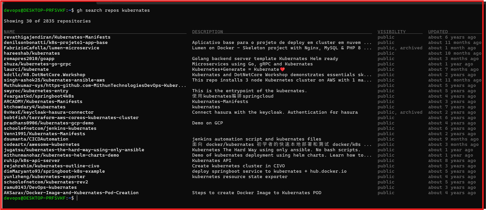
