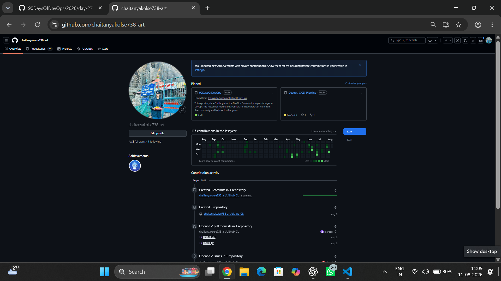
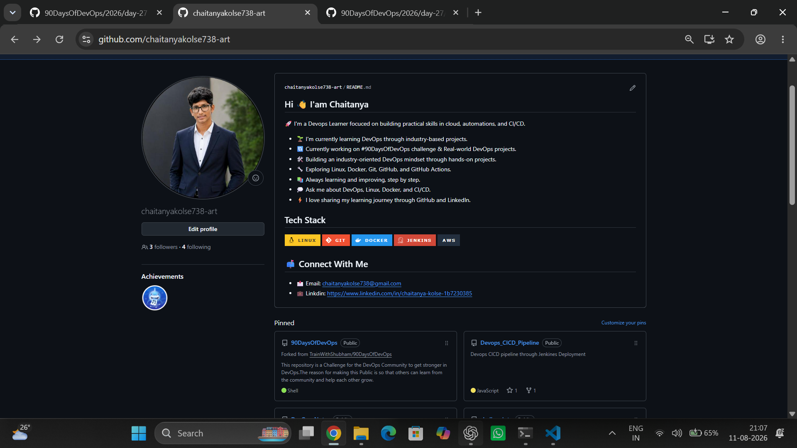

# Day 27 - GitHub Profile Makeover: Build Your Devloper Identity

## Task 1: Audit Your Current GitHub Profile

1. Visit your own GitHub profile as if you were a stranger — what impression does it give?

- My Github Profile does not look fully polished or complete.

- it does not clearly show what I do, What I am stydying, or what I am currently working on.

- Some important information is missing from my profile, so a stranger or recruiter may not immidiately understand my Devops Journey.

2. Answr in your notes.

- is your profile picture professional ?
  - NO 

- is your bio filled in ? Does it say what you do ?
  - NO

- Are you pinned repos revelent pr are they ramdom forks ?
  - I have both relevant repositories and forks.

- Do your repos have descriptions, or are they blank 
  - Most of them do not have proper descriptions.

- would a recruiter understand what you've been working on ?
  - NO , not imediatly.

## Task 2: Create Your Profile README

- Introduction — Chaitanya, Aspiring DevOps & Cloud Engineer passionate about Cloud, Linux and Automation.

- What I'm working on — 90 Days of DevOps Challenge

- Skills & Tools — AWS, Linux, Docker, Kubernetes, Jenkins, Git, GitHub, Python & Shell Scripting

- Tech Stack section

- Current Learning section

- Contact section — Email & LinkedIn

## Task 3: Organize Your Repositories

| Repo | Status |
|------|--------|
| 90DaysOfDevOps | Updated |
| shell-scripting | Updated |
| DevOps_Notes | Updated |
| PERN-Store | Updated |
| Devops_CICD_Pipeline | Updated |

All repositories have:

- Descriptive repository names
- One-line GitHub descriptions
- README.md explaining contents

## Task 4: Pin Your Best Repositories

Selected pinned repositories

- 90DaysOfDevOps
- shell_scripting
- DevOps_Notes
- PERN-Store
- DevOps_CICD_Pipeline

## Task 5: Before-After

### 3. Things improved

**Added a Professional Introduction**
Added a Profile README with a clear introduction so visitors immediately know who I am and what I do.

**Organized Profile Layout**
Structured the profile into sections such as About Me, Tech Stack, Current Learning, Certifications, and Contact.

**Highlighted Skills Clearly**
Listed my AWS, Linux, Docker, Kubernetes, Git, GitHub, Python and Shell Scripting skills for better visibility.

**Pinned Relevant Projects**
Pinned my best DevOps projects to showcase practical learning.

**Improved Repository Documentation**
Updated repository descriptions and README files to make projects easier to understand.

---

## Learning Outcome

GitHub is more than just a place to store code.

A well-organized GitHub profile acts as a technical portfolio that showcases your projects, skills, documentation, and consistency.