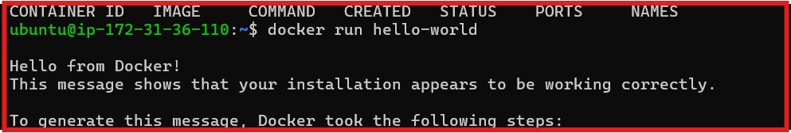
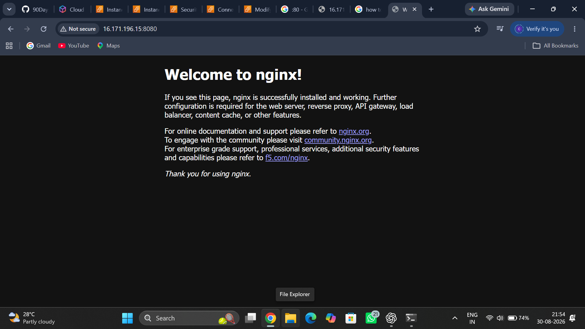
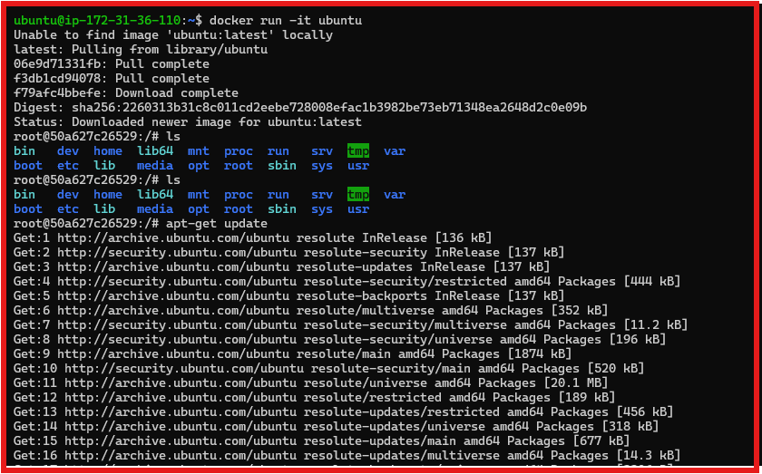
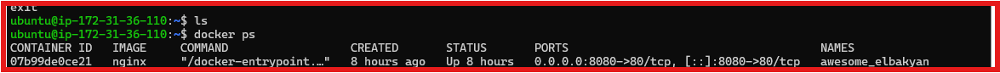
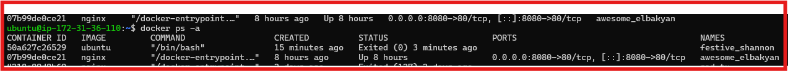
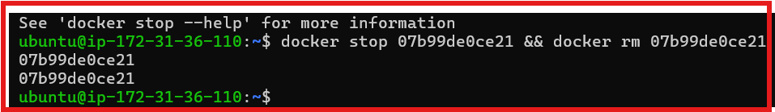
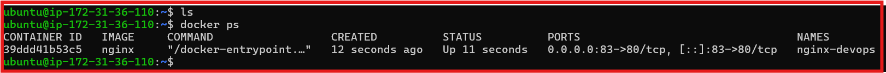
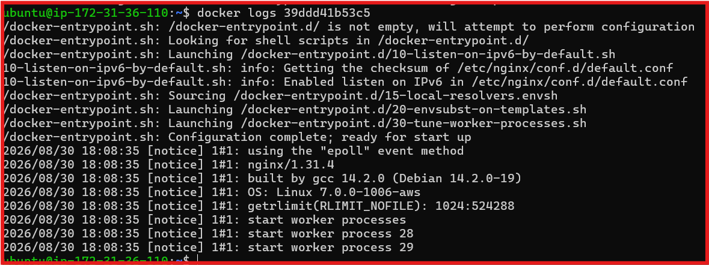
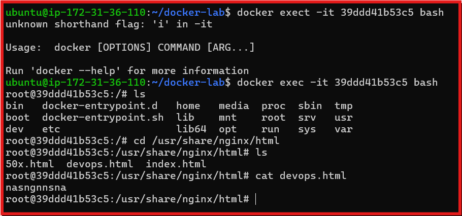

# Day 29-Introduction to Docker

## Task 1: What is Docker 

### 1. what is a container and why do we need them?
 - a container is a lightweight, standalone, and executable package of software that includes everything needed to run an application code libraries and pack in box mens contaier and run anywhre any envornment it will run everywhere.

 - in production we install all things on server where application run insted of isntall all liberes version and package we use docker container pack all thing in box and run on server directly.

### 2. Containers vs Virtual Machines-what's the real difference?
- a virtual machine an entire computer system-including its own operating system.

- container only virtualizes files software layers above the operating system and sheres the host machine's kernel

## Containers vs Virtual Machines

| Feature | Containers | Virtual Machines |
|----------|------------|------------------|
| Virtualization | OS-level | Hardware-level |
| Operating System | Shared Host Kernel | Separate Guest OS |
| Startup Time | Seconds | Minutes |
| Size | MBs | GBs |
| Performance | Faster | Slower |
| Resource Usage | Low | High |
| Isolation | Process-level | Full OS |
| Portability | High | Moderate |
| Best Use Case | Microservices, CI/CD | Multiple OS Environments |


## Docker Architechture

Docker follow a client-server architecture consisting of five major components. 

### Docker client

The **Docker Client** is the command-line interface (CLI) used to communicate with `Docker`

*common-commands*

```bash
docker build
docker run
docker ps
docker pull
docker push
```

----

### Docker Deamon

The **Docker Deamon (`Dockered`)** is the background service responsible for managing Docker resources.

Responsibilities

- build images
- create and manage containers
- manage network
- manage volumes

### Docker image

A Docker image is a read-only template containing the application code , dependencies, librabries and configuration required to create container.


### Docker Container

A Docker Container is a running instance of a Docker image this is execute an application in an esolated environment.

It is execute the docker image which make from docker file and strt the last cmd command and make a runnig contianer who continousely running on the machine.


### Docker Registry

A Docker Registry store Docker images.

**Type**

- public- Docker Hub
- private - Enterprise Registry

**oprations**

 - pull images
 - push images

### Docker Architecture Diagram

```

                +----------------------+
                |    Docker Client     |
                +----------+-----------+
                           |
                      Docker API
                           |
                           ▼
                +----------------------+
                |    Docker Daemon     |
                |      (dockerd)       |
                +----------+-----------+
                           |
          +----------------+----------------+
          |                                 |
          ▼                                 ▼
 +-------------------+            +--------------------+
 | Docker Images     |            | Docker Containers  |
 +-------------------+            +--------------------+
                           |
                           ▼
                +----------------------+
                | Docker Registry      |
                | (Docker Hub)         |
                +----------------------+
```

---


## Task 2: Install Docker

Installed Docker on an ubuntu Ec2 Instace, configured Docker for not-rrot usage, verified the installation, and execute the first container.


** Verify Docker Installation
---
Docker internally returen permission error because use dose not part of docker group

### Commands

Sudo usermod -aG docker $USER
newgrp docker


## Run Hello world container

```bash
docker run hello-world
```



### What happened ?

1. Docker searched for the image locally
2. pulled image from docker hub
3. create a container 
4. start container
5. execute the application
6. display the message and exited
7. exited because container is short proecess if process complete then container end.

## Task 3: Run Real Container

### 1. Run an Nginx Container
----

start an Nginx container , exposed port 8080



### 2. Run an Ubuntu Container in interactive Mode

Explore an ubuntut cotainer as lightweight Linux environment.

verified.

- package update
- Current user
- Directory structure
- Shell environment
- Exit operation




### 3. List Running Containers



### 4. List all containers




### 5. Stop & Remove a Containers




## Task 4: Explore

### 1. Run a container detached mode?

```bash

docker run -d ubuntu

```

Run the container in the background wile kepping the terminal alive

---

### 2. Assign a Custom container Name


```bash
docker run -d --name nginx-devops -p 83:80 nginx

```

Assign the meanigfull name insted of Dockers' assign random name to his container.

----


### 3. Map a Host port to a contaier Port

**Command**

```bash
docker run -d --name nginx-devops -p 83:80 nginx

```

**Syntax**


```bash

<host_port>:<container_port>

```
**Example**

- 83:80

Request send to **Ec2_public_Ip:83** are forwarded to **port 83** inside the contianer.




### view Container logs

** docker logs nginx-devops **

Display runtime logs for monitoring and troubleshoooting



### 5. Execute Commands inside a Running Conatainer

```bash
docker cp index.html nginx-devops:/usr/share/nginx/html/index.html
docker exec -it nginx-devops bash
```
- Copied a custom HTML file into the Container.

- Verified the file inside the Nginx web root.

- Accessed the container interactively.




## Interview Takeaways
- Docker Image is a blueprint; Container is its running instance.
- Docker Client communicates with the Docker Daemon.
- Docker Hub is a public Docker Registry.
- Containers share the host OS kernel, unlike Virtual Machines.
- Detached mode (-d) runs containers in the background.
- Port mapping (-p) exposes container services to the host.
- docker logs is used for troubleshooting.
- docker exec opens an interactive shell inside a running container.
- docker cp copies files between the host and a container.
