# Day 30 - Docker Images & Container Lifecycle

## Objective

- Learn Docker image management, understand image layers, practice the complete container lifecyle, work with running contianers, and perform Docker cleanup.

---

## Task 1: Docker Images

### 1. pull nginx ,ubuntu, and alpine images from Docker hub.

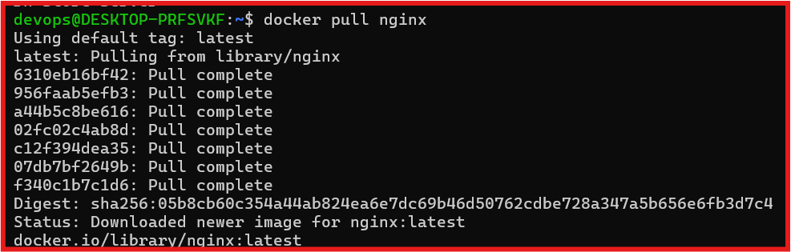

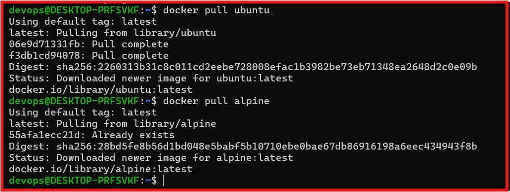

---

### 2. List Available Images

| image | Observation |
|--------|-------------|
| Alpine | Lightweight |
| ubuntu | Genral-purpose Linux image |
| Nginx | Web Server image |

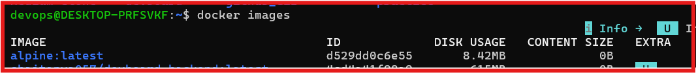

---

### 3. compare `ubuntu` Vs `alpine - why is one much smaller

- alpine does not include common tools like curl, git , python , or even the bash shell by default 

- BusyBox Power: It replaces standard Linux core utilities with BusyBox, a single executable that contains tiny versions of many common UNIX utilities.

---

### 4. inspect Docker image

- Verified image metadata Including repository, entrypoint, expossed port, envornment variable, and image layers.

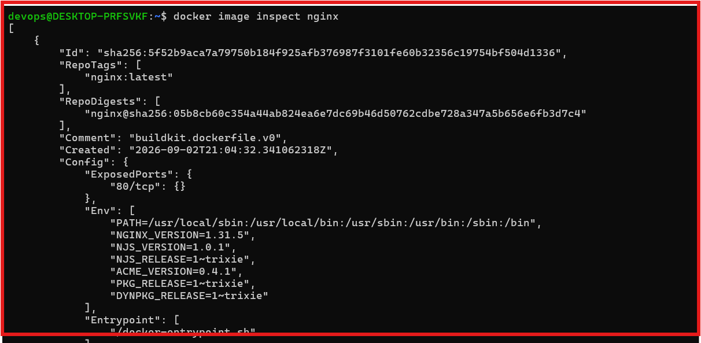

----
### 5: Remove an Unuse image

- Remove the Unuse image from local repository 

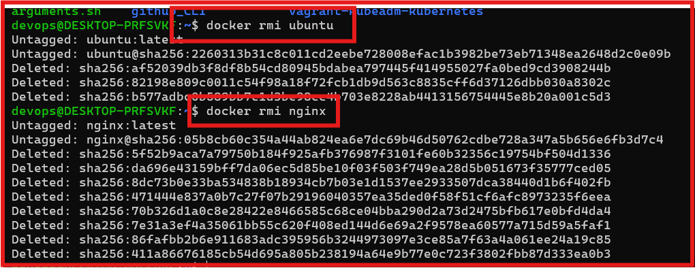

## Task 2: Image Layers

### 1. show the history of dockaer Images

#### Key Observation 

 - Every Dockerfile instruction Create a new Layer
 - metadata instruction create `0B` layers.
 - cached layers improve build performance.

 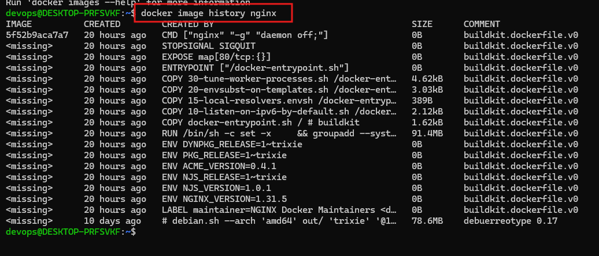

 ----

 ## Task: 3 Contaienr Lifecycle

 - practice the full lifecycle on one contianer understtod how to container works.

1. Create Container
2. Start Container
3. Pause Container
4. Unpause Container
5. Stop Container
6. Restart Container
7. Kill Container
8. Remove Container

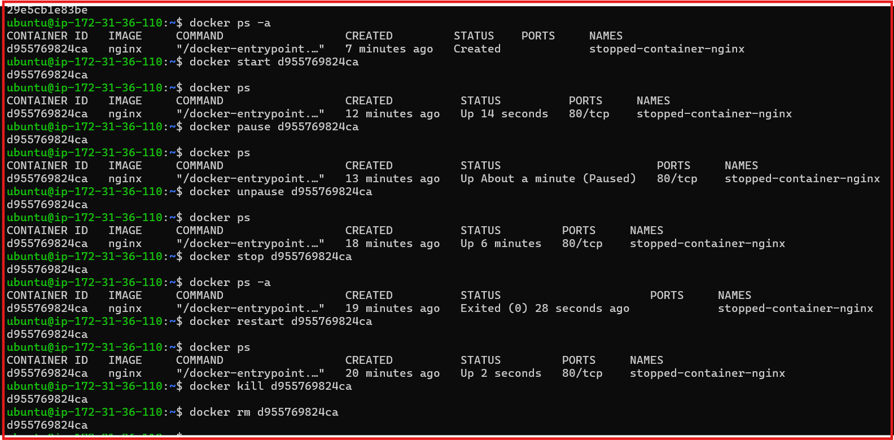

---

## Task 4: Working With Running Container

### 1. Start an Nginx Container in detached mode port expost `80`

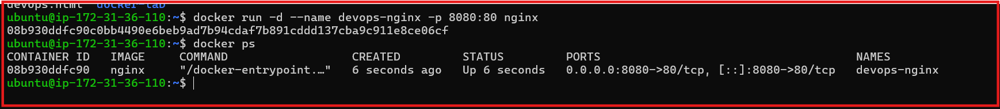

-------

### 2. View contianer logs histoy `normal logs`

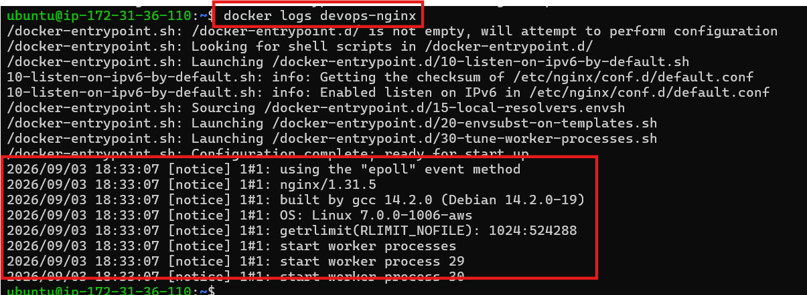

### 3. View REal-time logs 
 - see the container live logs use in real industyr to see live logs of container us ein monitoring to send alerts.

 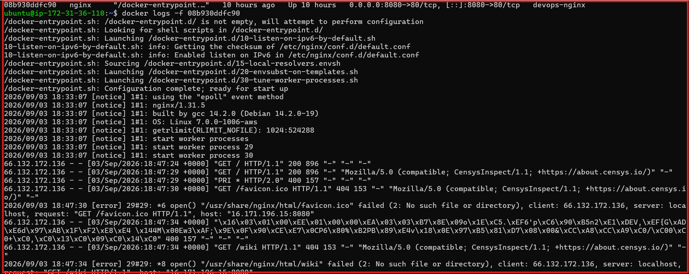

 -------

### 4. Exec container and look aroung the filesystem

 - Go to inside container and obeserb the filese system contianer also have filesystem in this system have container filese to run the container process.

 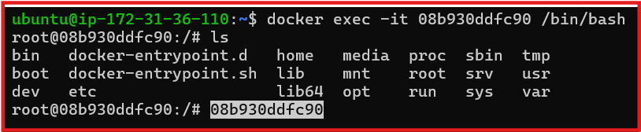

---

### 5. Run single command inside the container without entering it 

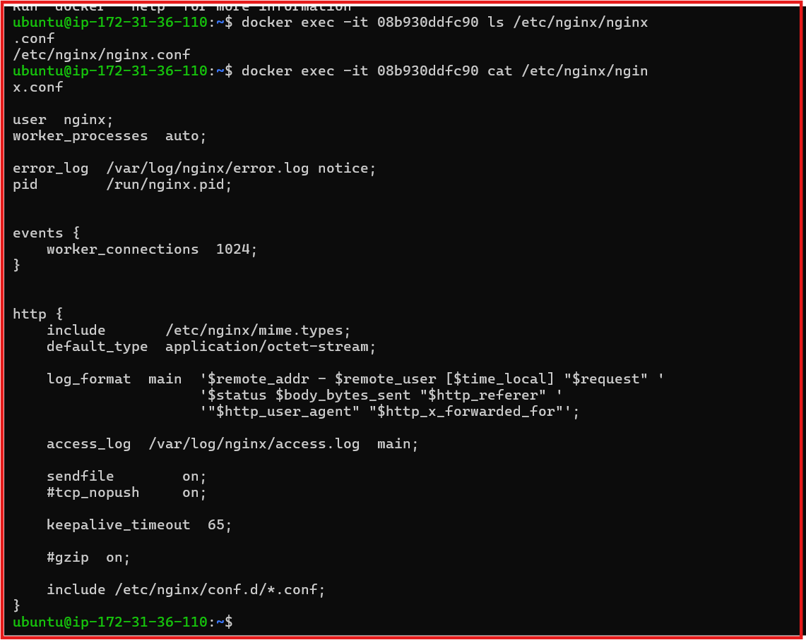

----

### 6. Inspect the Container - find its ip address , port mappings, and mounts

- See Ip address
- port mapping
- mounts

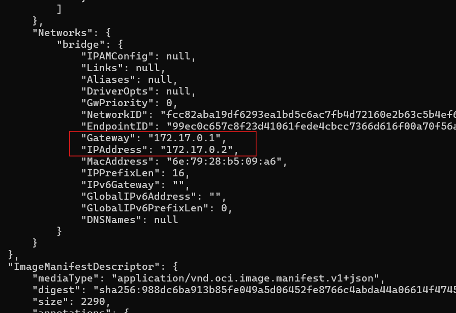

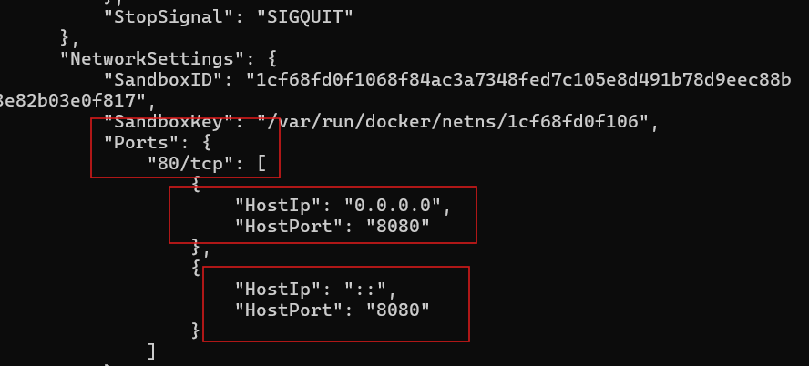

---

## Task 5: cleanup

### 1. Stop all Running Containers in one command

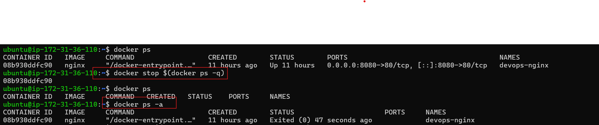

-----

### 2. Remove all Stopped Container in one command

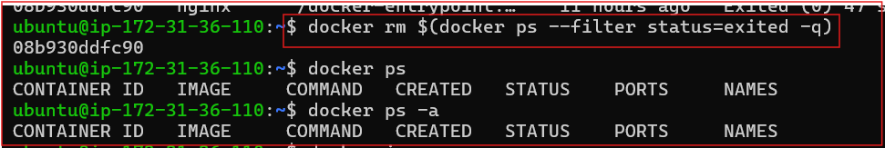

---

### 3. Remove unused images

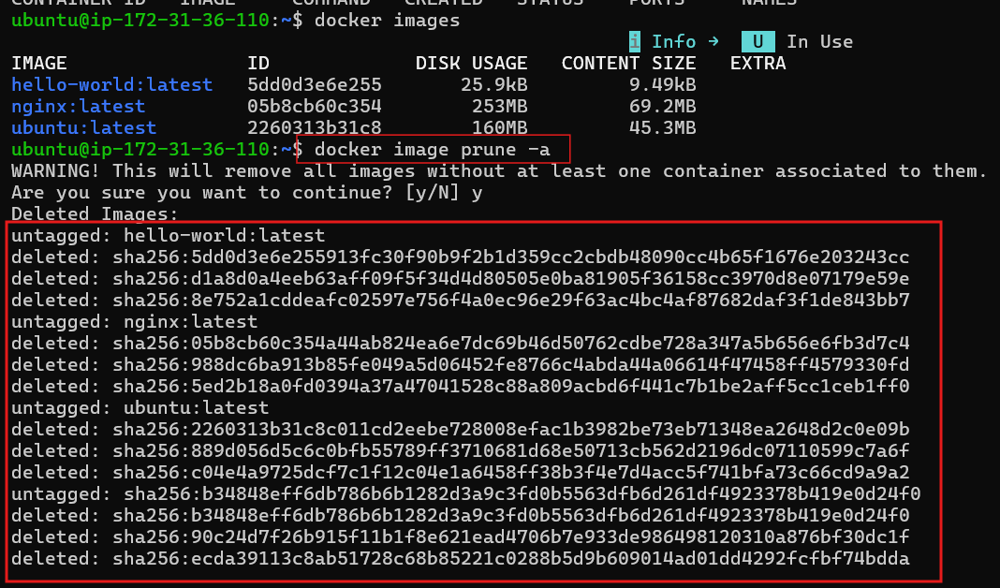

---

### 4. Check how much disk space Docker is Usin

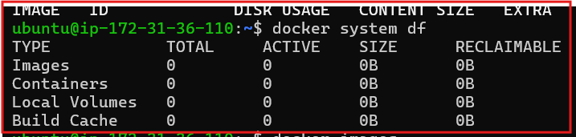

