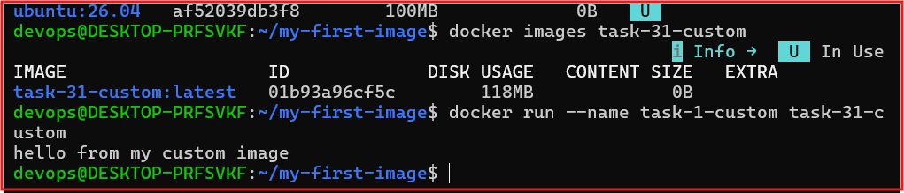
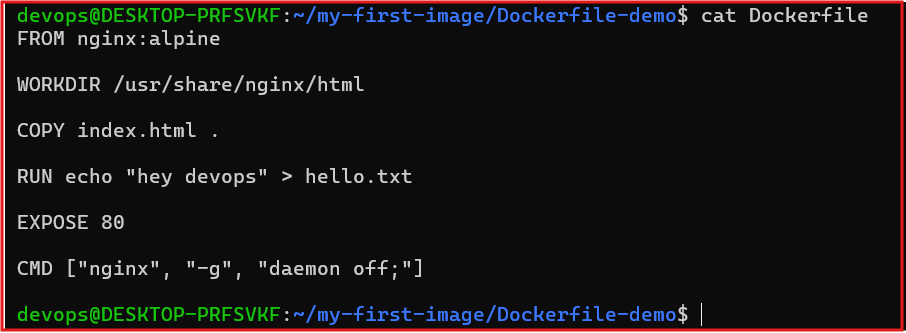
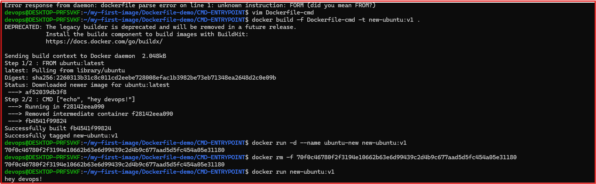
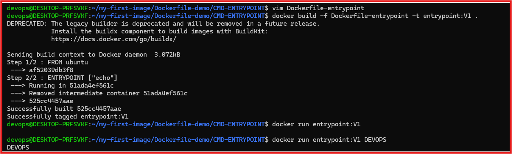
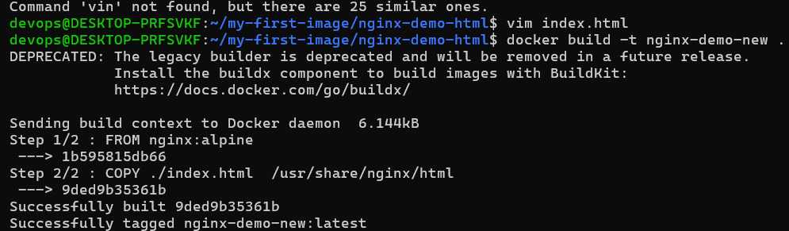
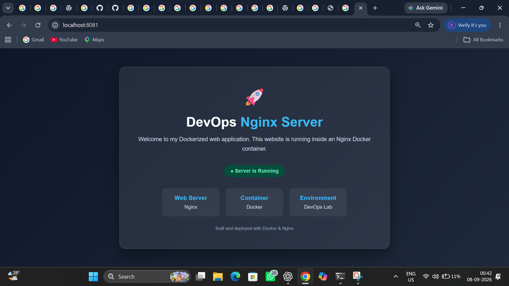
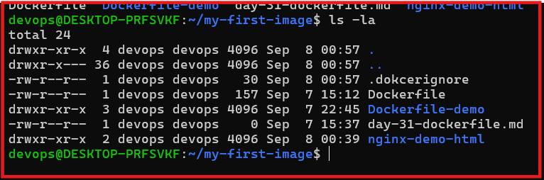
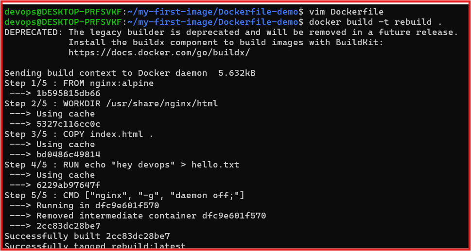

# Day 31- Dockerfile: Build Your Own Images

## Objective
- Write Docker file and build our custom images. its helps to seprates someone who uses Docker from someone who actully ships with Docker.

## Task 1: Your First Dockerfile

- create and run a custom Docker image using Ubuntu as the base image.

### Source File

**Dockerfile:** [my-first-image/Dockerfile](my-first-image/Dockerfile)

### Steps performed

1. Created the my-first-image project directory
2. Wrote a dockerfile using `ubuntu` as base images
3. Install `Curl` using Run Instruction
4. Configured a Default Command Using CMD
5. Build the Docker image With the Tag My-ubuntu:V1.
6. Run The Contianer and Verified the Output

### Verification

- Docker image build Sucessfully.
- Docker Container started SucessFully 
- Default message printed which excepted

----------

## Task 2: Dockerfile Instruction

### Objective 
- To Understand and implement the Core Dockerfile instruction used to define an application's Filesytem, working environment, exposed ports, and startup behavior

### Instruction Practiced

- FROM - Base image selection
- WORKDIR - Working directory configuration
- COPY - Application file transfer
- RUN - Built-time Commands
- Expose - Application port Documentation
- CMD - Default container command

## Source File 

- **Dockerfile:**  [nginx-demo-html/Dockerfile](nginx-demo-html/Dockerfile)

- **HTML Files:**  [nginx-demo-html/index.html](nginx-demo-html/index.html)

## Steps Performed

1. Created a Custom index.html page
2. Wrote a dockerfile using the above instruction
3. Build the Docker image.
4. Started the Nginx Container
5. Verified the Application in the Browser

## Verfication

- Docker image build successfully
- Nginx Container Started Successfully.
- Application served successfully Nginx in the browser.

### Key Learning
- understood how to individual Dockerfile instruction contribute to final image and container runtime configuration. 

------------

## Task 3: CMD VS ENTRYPOINT

### Objective To Experimentally Campare `CMD` and `ENTRYPOINT` and understand how they behave when commands or argument are supplied during container execution.

### Source Files

- **CMD Dockerfile:** [CMD-ENTRYPOINT/Dockerfile-cmd](CMD-ENTRYPOINT/Dockerfile-cmd)

- **ENTRYPOINT Dockerfile:** [CMD-ENTRYPOINT/Dockerfile-entrypoint](CMD-ENTRYPOINT/Dockerfile-entrypoint)

### Comparison

| CMD | ENTRYPOINT |
|------|------------|
| Provide the default command | Defines the main executable |

| Can be Overridden | Alwasy executes 
| Suitable for optional runtime commands | Suitable for fixed application startup |

### Steps performed

1. Build a Docker image using **CMD**
2. Build anothere image using ENTRYPOINT
3. Execute both containers.
4. Passed runtine arguments.
5. Compared the behaviour.

### Verification

- Successfully Verfied the Behaviour of CMD
- SuccesFully Verified the behavour of ENTRYPOINT

## Task 4: Build a Simple Web App image

### Objective
- To Containerize a static web Application using Nginx and make it Accessable Through Docker port Mapping.

### Source Files

- **DockerFile:** [nginx-demo-html/Dockerfile](nginx-demo-html/Dockerfile)

- **HTMLFiles:**  (nginx-demo-html/index.html)(nginx-demo-html/index.html)

### Steps performed

1. Created a static HTML webpage.
2. Wrote the Dockerfile
3. Build the Docker image.
4. started The Nginx Container.
5. Accesed the application.

### Varification
- Docker image build successfully.
- Website deployed Sucessfully.
- Browser output Verified

-----

## Task 5: Using .Dokcerignore

### Objective 

- To manage the Docker build Context by Excluding unnecessary and sensitive project file using .Dockerignore

### Source File

- **.dockerignore:** [my-first-image/.dokcerignore](my-first-image/.dokcerignore)

### Ignored Files

- `node_modules`
- `.git`
- `.env`
- `*.md`

### Steps Performed

1. Created a .dockerignore file.
2. Added ignore rules
3. Rebuild the Docker image
4. Verfified ignored files were excluded from teh build context.

### Verification
- Docker build context optimized Sucessfully
- Unnecessary Files were exclude 

----

## Task 6: Docker Layer Caching

## Objective

Understand Docker layer catching and its impact on build performace

### Step Performed

1. Build the Docker image
2. Modified the application
3. remove the expose line in the dokcerfile
4. Rebuild the image
4. Observe the change use cache and build fastly insted of build again whole.

### Key obeservation

- Docker Creates image layer by layere.
- Every Dockerfile instruction create a seprate layer.
- unchange layer are reused from cache
- Only modified layer and subseqeunt layers are rebuild.
- Proper instraction ordering improve build performance.

### Verification 

- Sucessfully obeserved Docker layer catching.
- Verified faster image rebuilds.

## Key Takeaways
- Built custom Docker images using Dockerfiles.
Learned the purpose of commonly used Dockerfile instructions.
- Compared CMD and ENTRYPOINT with practical examples.
- Containerized and deployed a static website using Nginx.
- Optimized Docker build context using .dockerignore.
- Improved image build performance using Docker layer caching.
- Successfully built, tested, and verified Docker applications on Browser.
 