# Day 32 - Docker Volumes & Networking

## Objective

Learn how Docker manages persistent data using **Named Volumes** and **Bind Mounts**, understand Docker networking concepts, enable container-to-container communication, and build a simple multi-container application using custom networks and persistent storage.

---

## Prerequisites

- Docker Engine installed
- Basic Linux command knowledge
- Internet connection to pull Docker images

---

## Technologies Used

- Docker
- MySQL
- Postgres
- Nginx
- Alpine Linux
- Ubuntu EC2

---

# Task 1: The Problem (Container Data Loss)

### 1. Run a Postgres Container

Started a postgres contaier and create a simple database with employes record.

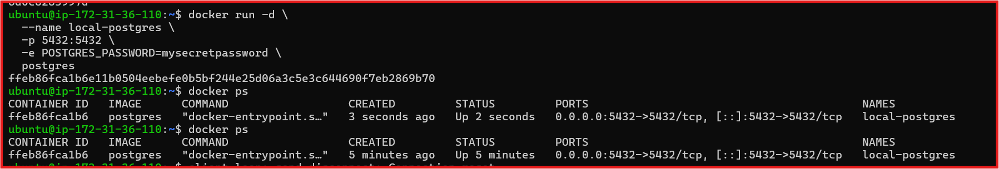

### 2. Create a Data tables for the employees

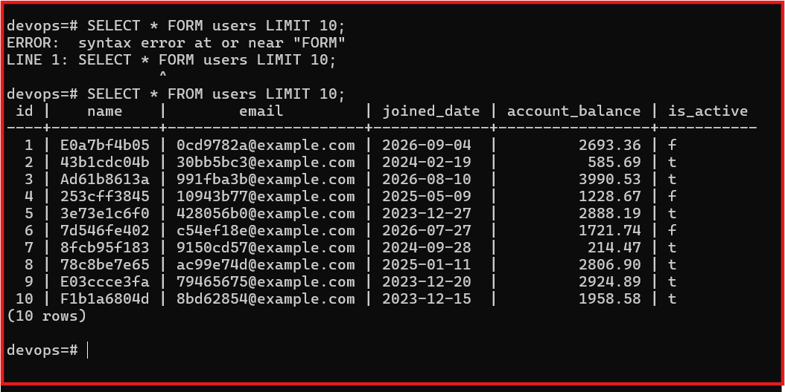

### 3. Stop And Remove thsi postgres Contianer

### 4. Started Postgres Container AGain 

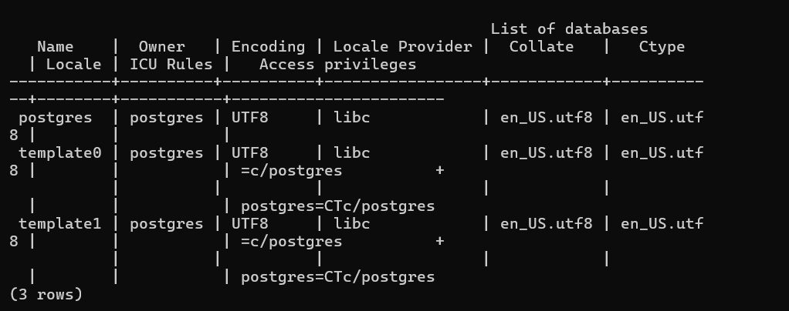

## Observation

The data was lost after removing the container and run again the same container because it was stored in the container's ephemeral writable layer.

---

## Task 2: Named Volumes

### STeps

### 1. Create a Docker Nemaed Volume.
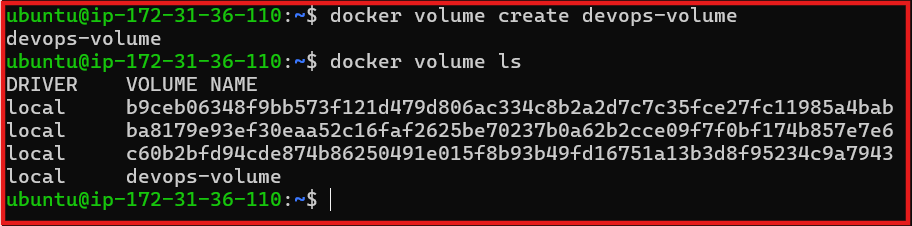

### 2. Created Sample data inside the Database

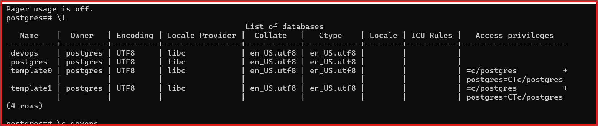

### 3. Stopped and removed the the PostgresQl Cotnainer 

### 4. Run Brand New Container With The Same Volume

### 5 But This Time data is safe Because of volume is  Mounted

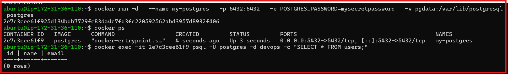

## Verification

- Verified the Named Volume using Docker volume listing and inspection.

## Observation

- The data persisted after the container was removed because the Named Volume exists independently of the container lifecycle.

--------

### Task 3. Bind Mouts

### 1. Created a host directory containing an index.html file.

### 2.Started an Nginx container with the host directory mounted to the Nginx web directory.

### 3. Accessed the Nginx page through the browser.

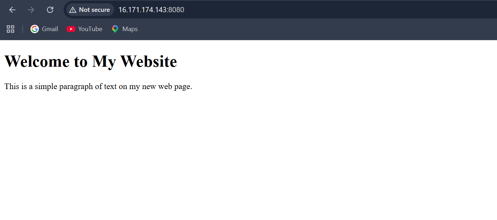

### 4. Modified the index.html file on the host machine.

### 5. Refreshed the browser and verified the updated conten

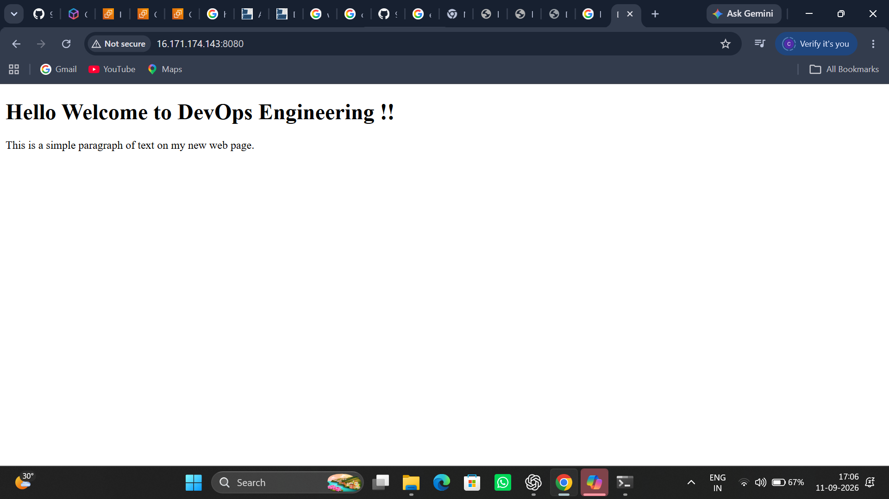

## Observation

- Changes made to the host file were immediately reflected in the Nginx container.

## Difference
- Named Volume: Managed by Docker.
- Bind Mount: Uses a specific path from the host machine.

-----

## Task 4 Dcoker Networking Basic

### 1. Listed all Docker networks available on the system.

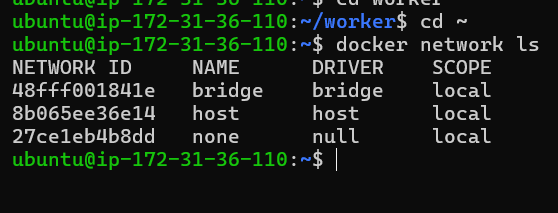

### 2. Inspected the default Bridge Network.

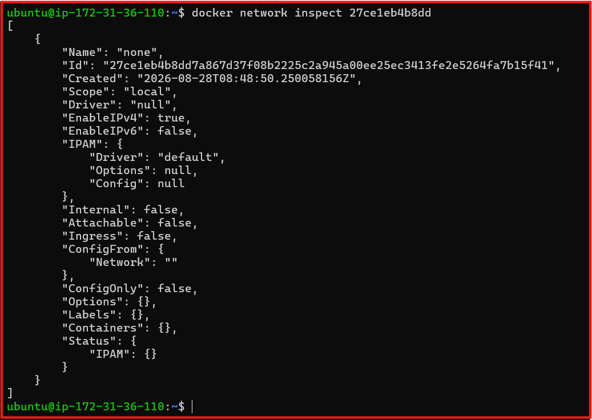

### 3. Run two containers on the default Bridge Network and tested name-based communication.

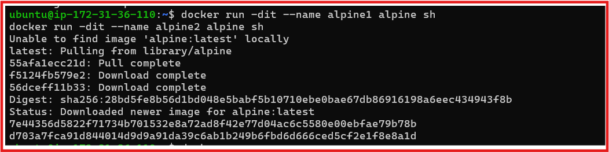

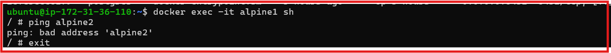

### 4. Tested communication between the containers using their IP addresses.

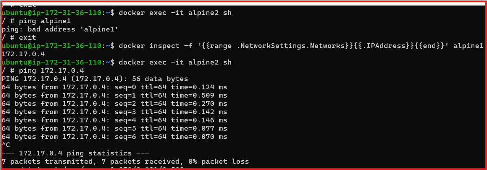

## Observation

- The containers could communicate using their IP addresses, but automatic name-based communication was not available on the default Bridge Network.

## Task 5. Custom Networks

### 1. Created a custom Bridge Network named my-app-net.

### 2. Started two containers on the my-app-net network.

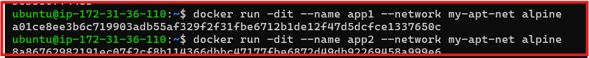

### 3. Tested communication between the containers using their container names

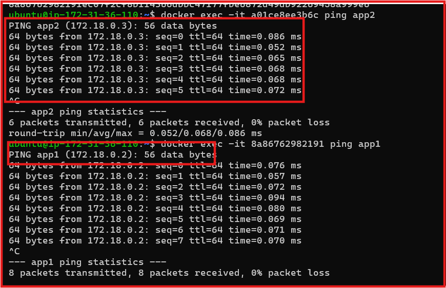

## Observation

- The containers successfully communicated using their names because user-defined Bridge Networks provide automatic DNS-based name resolution.

## Task 6: Put It Together

### 1. Created a custom Docker network.

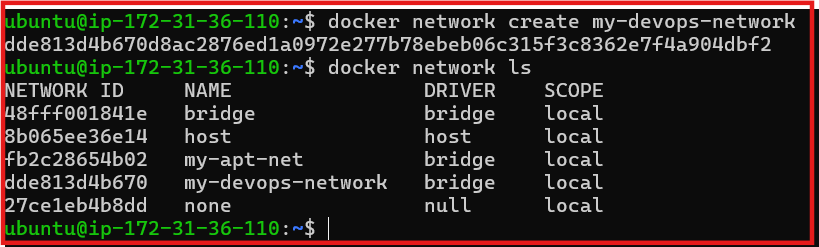

### 2. Started a database container on the network with a Named Volume for persistent data.

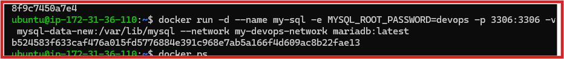

### 3. Started an application container on the same network

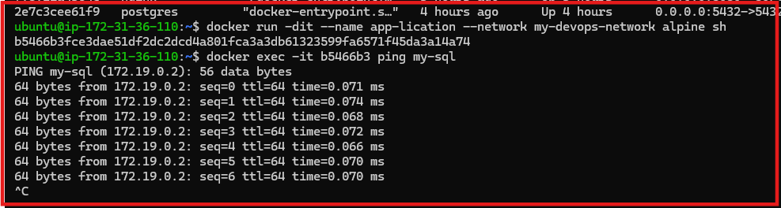

### 4. Verified that the application container could reach the database using the database container name.

## EC2-Clenup-Task

### 1. Delete all the container running on ec2 single command.

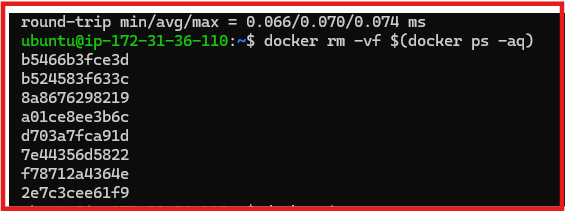

### 2. Delete all images running on Ec2 (one-cmd-rm-all)

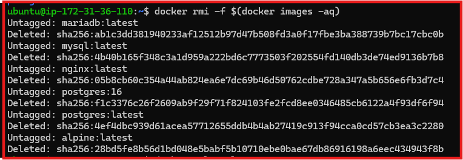

### 3. Delete all Volumes which we Created (user-defined) (onc-cmd-rm-all)

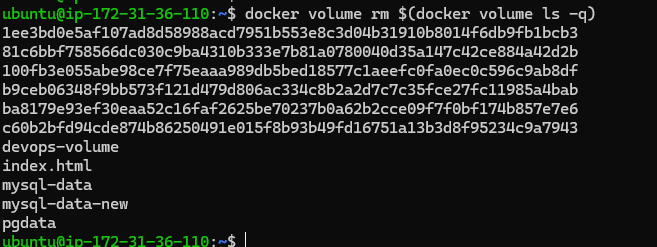

**Observation**

- The application successfully communicated with the database using its container name, while the Named Volume provided persistent database storage.

## Key Takeaways
- Named Volumes → Persistent data storage.
- Bind Mounts → Direct host-to-container file sharing.
- Default Bridge → Basic container networking.
- Custom Bridge → Container communication using names.
- Volumes + Networks → Persistent data and reliable container communication.