# Day 33 - Docker Compose: Multi-Container Basics

**Goal**: Run and manage a multi-container application using Docker Compose.

## 🎯 Obective 
- Understand how Docker Compose manages multiple containers from a single configuration file.
- Build a multi-container application using **WordPress and MySQL**.
- Understand **Compose networking, service discovery, volumes, persistence, and environment variables**.

## 🛠️ Technologies Used

- 🐳 Docker
- ⚙️ Docker Compose
- 🌐 Nginx
- 📝 WordPress
- 🗄️ MySQL
- 💾 Docker Volumes
- 🔗 Docker Networking
- 🔐 Environment Variables

----

# Task 1 - Install & verify Docker Compose

### 1. Check Docker Compose 

- verfified that Docker Compose was available on the system.

### 2. verify version

- Checked the install compose version to confirm that the environment was ready.

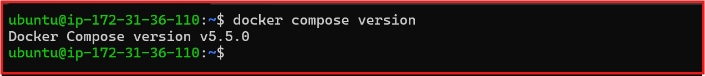

# Task 2. First compose Application

### 1. Create a svperate Created a separate `compose-basics` directory for the first Compose application.

### 2. Created a `docker-compose.yml` file and defined an Nginx service.

- docker-compose: [compose-basic/docker-compose.yml](compose-basic/docker-compose.yml) 

### 3. Start the Nginx application with Compose

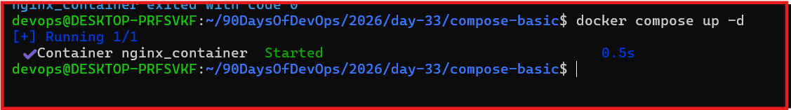

### 4. Verify in Browser

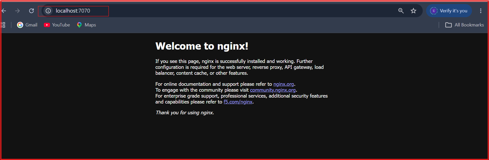

### 5. STop it With Docker Compose Down

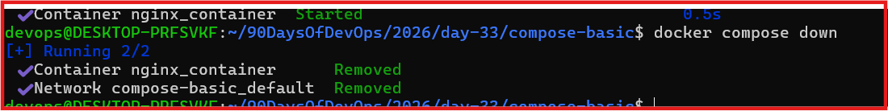

# Task 3: Build a WordPress & MySQL Multi-Container Application

 ### 1. Create the WordPress Compose Project
Created a Docker Compose project containing two services:

- WordPress
- MySQL

Configured a named volume for persistent database storage and allowed both services to communicate over the default Docker Compose network

wordpres & mysql Compose :- 

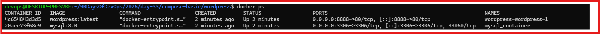

### 2. Verify Running Containers 

- verfied the both wrodpress and MySQL containers were created and running successfully.

### 3. Deploy the Multi-Container Application
Started the complete application using a single Docker Compose configuration.

- Docker Compose automatically:

- Pulled the required images
- Created the project network
- Created the named volume
- Started both containers

### 4. Verify Docker Network

- Confirmed that Docker Compose automatically created a dedicated bridge network for the project.

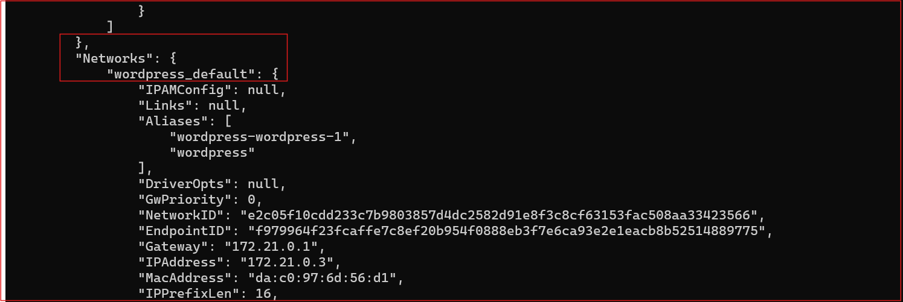

### 5. Verify WordPress Dashboard

Successfully logged in to the WordPress Admin Dashboard and confirmed that the application was working correctly.

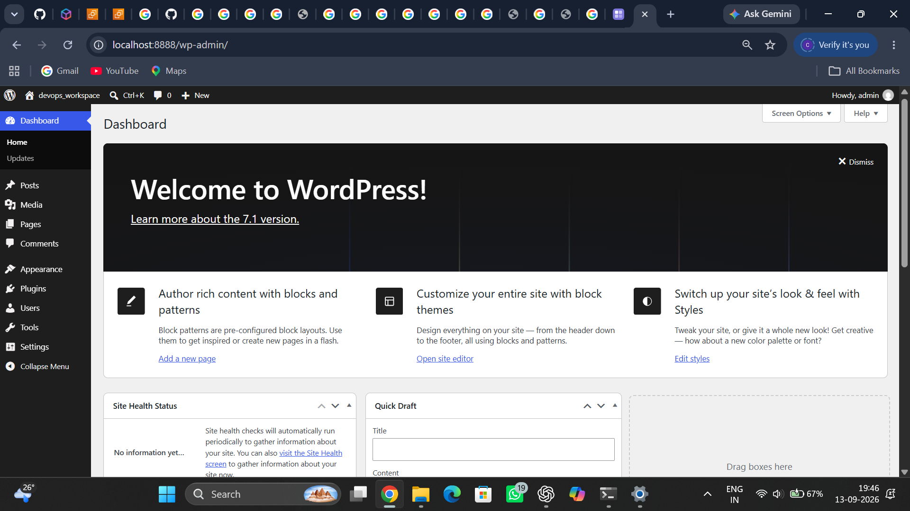

## Key Observation

- Docker Compose automatically created the required network and named volume.

- WordPress connected to MySQL using the service name instead of an IP address.

- Database data persisted even after recreating the containers.

- A complete multi-container application was deployed using a single Docker Compose file.

# Task 4: Practice Docker Compose Commands

### 1. Start Services in Detached Mode

- Started all application services in detached mode and verified that the containers were running successfully in the background.

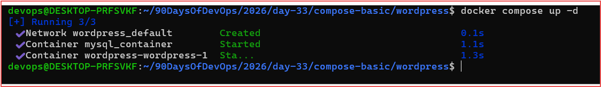

### 2. View Application Logs

- Viewed logs from all running services to monitor container activity and verify successful startup.

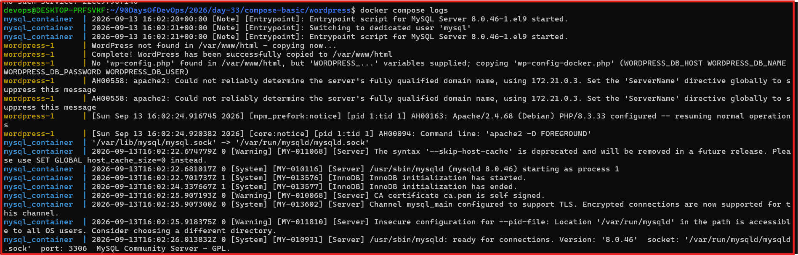

### 3. . View Logs for a Specific Service

- Filtered logs for the WordPress service to troubleshoot and monitor a single container.

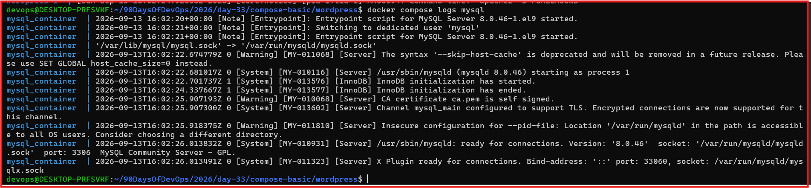

### 4. . Manage the Application Lifecycle

- Successfully performed service lifecycle operations including stopping, starting, restarting, and removing the application.

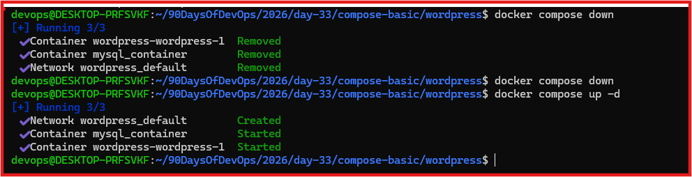

### 5. . Verify Application Availability
Confirmed that the WordPress application remained accessible after restarting the services.

.png)

## Key Observation

- Docker Compose provides a simple way to manage the complete application lifecycle.

- Individual services can be monitored and managed independently.

- Application data remained intact because the MySQL database was stored in a named volume.

- Restarting containers did not affect the application configuration or database.

# Task 5. Manage Environment Variables

### 1. Create a Dedicated Environment File
Created a .env file to store database credentials separately from the Docker Compose configuration.

Note: The .env file contains sensitive credentials and is excluded from the repository in production environments.

### 2. Update the Docker Compose Configuration

- Modified the Compose configuration to load database credentials from the .env file instead of hardcoding them.

[wordpress.env/docker-compose.yml](wordpress.env/docker-compose.yml)

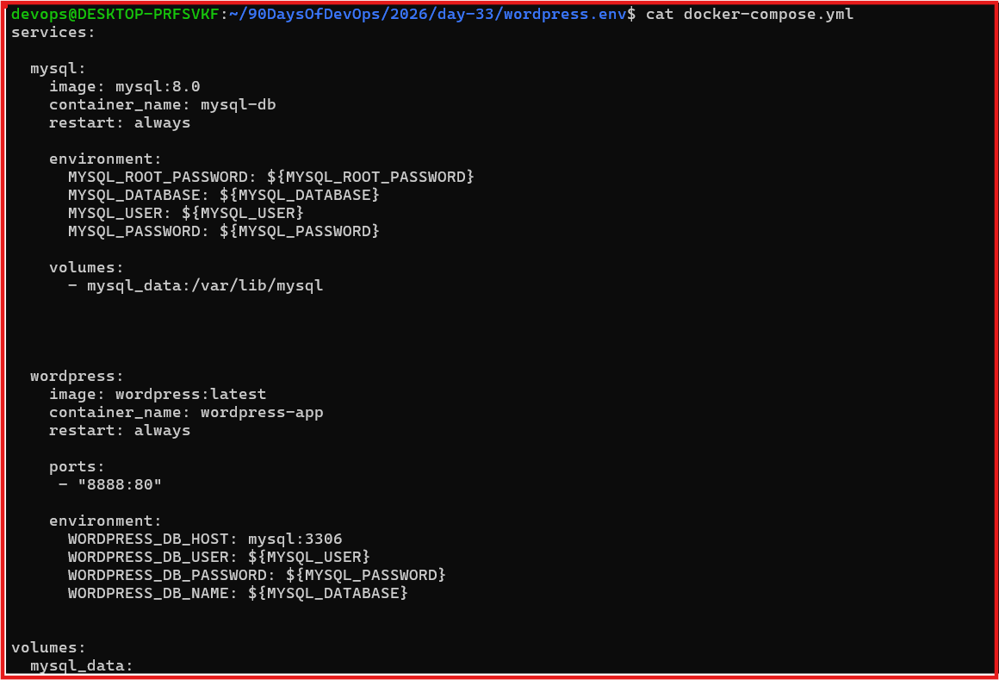

### 3. Validate Environment Variables
Verified that Docker Compose successfully loaded all variables from the .env file and generated the expected configuration.

3. Validate Environment Variables
Verified that Docker Compose successfully loaded all variables from the .env file and generated the expected configuration.

### 4. Deploy the Application
Successfully deployed the application using the externalized configuration and confirmed that both services started correctly.

### Key Observation

- Environment variables separated sensitive configuration from the Compose file.
- Docker Compose automatically loaded variables from the `.env` file.
- The configuration became cleaner, reusable, and easier to maintain across environments.

---

# Final Outcome

Successfully deployed a production-style multi-container WordPress application using Docker Compose. Configured automatic networking, persistent storage with named volumes, centralized application configuration using environment variables, and managed the complete application lifecycle through Docker Compose.

---

# Key Learnings

- Learned how Docker Compose simplifies multi-container deployments using a declarative YAML configuration.
- Built and deployed a complete WordPress and MySQL application from a single Compose file.
- Understood Docker Compose networking and service discovery using service names.
- Implemented persistent database storage using Docker Named Volumes.
- Practiced Docker Compose lifecycle commands for deploying and managing applications.
- Improved configuration management by externalizing sensitive values into a `.env` file.
- Learned how Docker Compose enables repeatable, scalable, and maintainable containerized deployments.