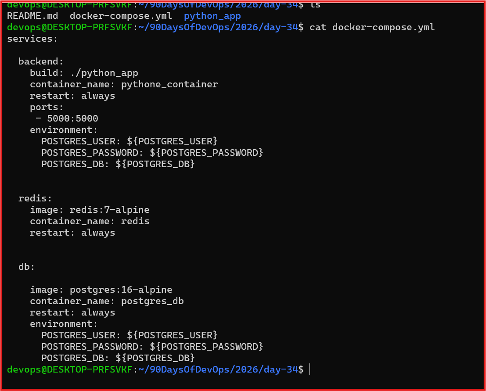
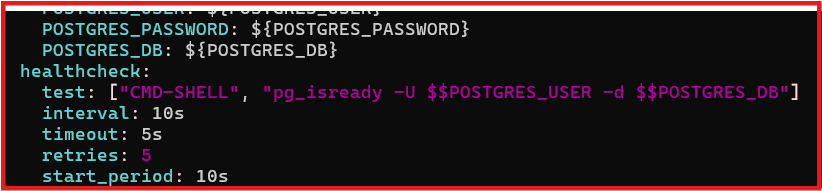
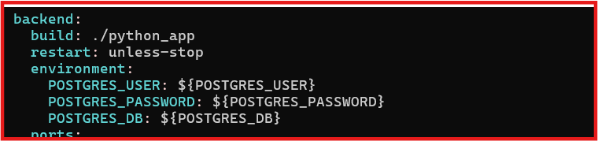
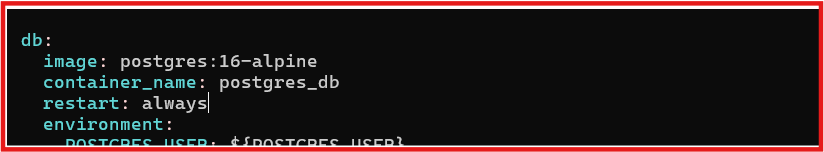
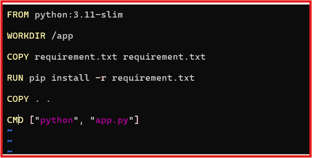
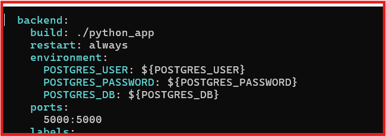
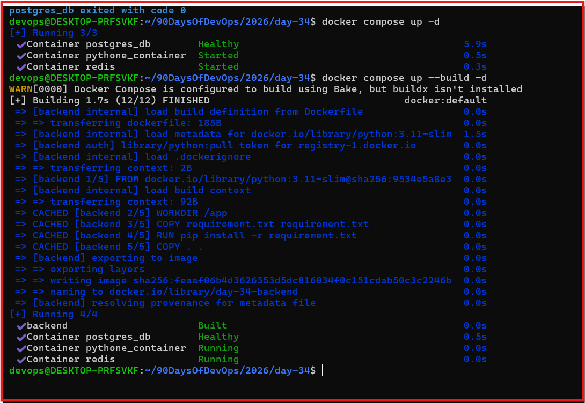
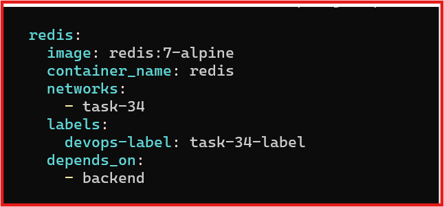
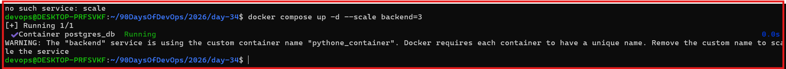

# Day 34- Docker Compose: Real-world Multi-Container Apps

## Objective

Build a production-like multi-container application using Docker Compose with:

- Web application
- PostgreSQL database
- Redis cache
- Healthchecks
- Service dependencies
- Restart policies
- Custom Dockerfile
- Named networks and volumes
- Service scaling

## Task 1: 3-services Application Stack

Created a 3-service stack using:

1. Web: Python Flask
2. Database: PostgreSQL
3. Cache: Redis

- compose-file:- [python_app/day-34-compose-advanced.md](python_app/day-34-compose-advanced.md)

**Implementation**
- Flask application runs as the web service.
- PostgreSQL stores application data.
- Redis provides caching.
- Services communicate using Compose service names.

## Task 2 – depends_on & Healthchecks

**Database Healthcheck**

1. Added a PostgreSQL healthcheck using pg_isready.
2. Configured the web service to depend on the database health status.

*Implementation*

- depends_on controls service dependency.
- condition: service_healthy waits for the database to become ready.
- Verified the database reaches healthy status before the web service starts.

## 3. – Restart Policies

***Implementation***

- Added restart: always to the database service.
- Manually stopped the database container.
- Verified that Docker automatically restarted it.

**Policy Comparison**

- always → continuously restarts the container.
- on-failure → restarts when the container exits with an error.
- unless-stopped → restarts unless manually stopped.

## Task 4 – Custom Dockerfile

**Implementation**

- Created a custom Dockerfile for the Flask application.
- Used build: in Compose instead of a pre-built application image.
- Modified the application code.
- Rebuilt and restarted the application

## Task 5 – Named Networks & Volumes

**Implementation**

- Created a custom Docker network for application communication.
- Created a named volume for PostgreSQL data.
- Added labels to services for organization.

**Result**

- Services communicate through the custom network.
- Database data persists using the named volume.
- Labels identify the application environment and project.

## vTask 6 – Scaling

### Tested web service scaling:

-docker compose up --scale web=3

**Observation**

- Multiple web containers can be created.
- Fixed host-port mapping causes a port conflict.
- Multiple containers cannot bind to the same host port.
Learning

- For production-scale applications, traffic needs to be distributed using a load balancer or orchestration platform.

## Verification

**Verified the complete stack:**

- Web application running
- PostgreSQL healthy
- Redis running
- Database dependency working
- Restart policy working
- Persistent database volume
- Custom network communication
- Application rebuild working
- Scaling behavior tested

## Key DevOps Learnings

- Docker Compose manages multi-container applications.
- Healthchecks verify service readiness.
- depends_on manages service dependencies.
- Restart policies improve service availability.
- Custom Dockerfiles provide application-specific images.
- Named volumes provide persistent storage.
- Custom networks provide controlled service communication.
- Scaling requires proper traffic routing.